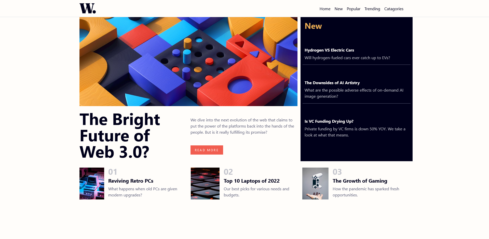

# Frontend Mentor - News homepage solution

This is a solution to the [News homepage challenge on Frontend Mentor](https://www.frontendmentor.io/challenges/news-homepage-H6SWTa1MFl). Frontend Mentor challenges help you improve your coding skills by building realistic projects.

## Table of contents

- [Frontend Mentor - News homepage solution](#frontend-mentor---news-homepage-solution)
  - [Table of contents](#table-of-contents)
  - [Overview](#overview)
    - [The challenge](#the-challenge)
    - [Screenshot](#screenshot)
    - [Links](#links)
  - [My process](#my-process)
    - [Built with](#built-with)
    - [What I learned](#what-i-learned)
    - [Continued development](#continued-development)
    - [Useful resources](#useful-resources)
  - [Author](#author)

## Overview

### The challenge

Users should be able to:

- View the optimal layout for the interface depending on their device's screen size
- See hover and focus states for all interactive elements on the page

### Screenshot

### Links

- [Solution](https://www.frontendmentor.io/solutions/news-homepage-with-bootstrap-and-some-custom-css-01IjkIWw8y)
- [Live Site](https://hassaneljebyly.github.io/news-homepage)

## My process

### Built with

### What I learned

first time using Bootstrap after 2 years of using only vanilla css, It's easy to use if you know css already but with so much limitations

### Continued development

Although I prefer vanilla CSS Bootstrap is a great workflow, probably gonna rarely use it but I would love to get comfortable with it

### Useful resources

- [Bootstrap Docs](https://getbootstrap.com/docs/4.1/getting-started/introduction/) - only resource you need, the best documentation I have ever read.

## Author

- Frontend Mentor - [@hassaneljebyly](https://www.frontendmentor.io/profile/hassaneljebyly)
- Twitter - [@HassanElJebyly](https://twitter.com/hassaneljebyly)
